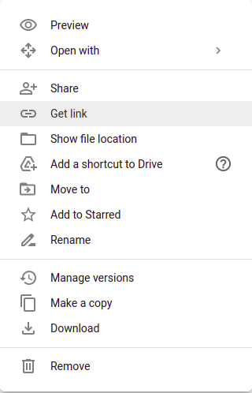
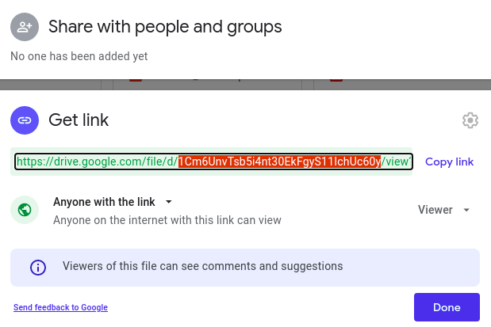
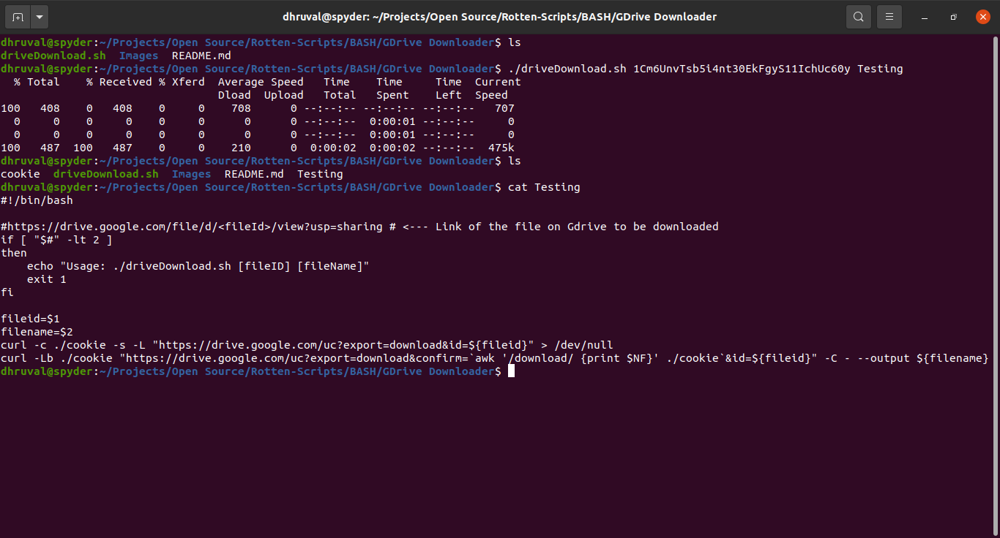
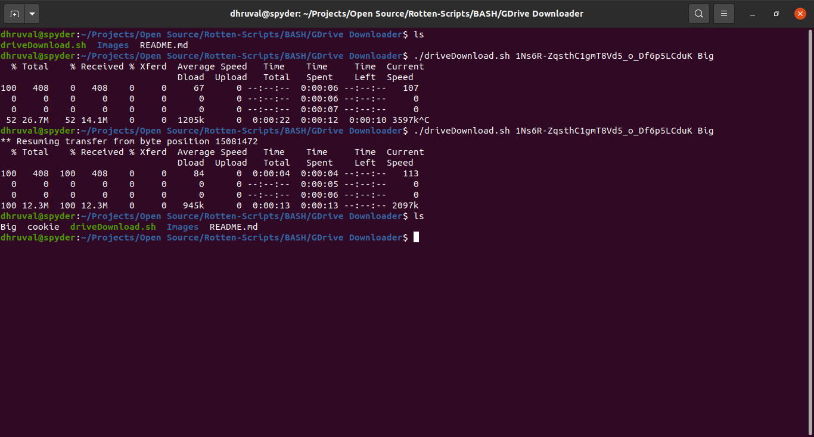

# Google Drive Downloader

Frustrated of failing Google Drive Downloads?
Have to restart downloading that darn file again and again?
Well, you are in luck!!
This script gives you peace of mind while downloading files from Google Drive. 
Downloads can be resumed later if your internet connection is lost without loosing any progress!!

## Note: 
The script works only on google drive links that allow anyone on the internet to view the file and have the following format:

```
https://drive.google.com/file/d/<fileID>/view?usp=sharing
```

## Setup instructions
### Dependencies
- [cURL](https://curl.se/)

### Usage
Install the dependencies:
```bash
$ sudo apt install curl
```

Get the file's link by right clicking on it and selecting the `Get link` option. Change the permissions as shown in the image below and copy the `fileID` portion of this link.
<table>
    <tr>
        <td valign="top"></td>
        <td valign="top"></td>
    </tr>
</table>

Download the file by passing the `fileID` present in the file's link (as shown above) and a `fileName` of your choice as command line arguments to the script. `fileName` is important for resuming downloads in case they fail in the middle.

```bash
$ chmod +x ./driveDownload.sh
$ ./driveDownload.sh <fileID> <fileName> 
```

In case a download fails, just rerun the above command with the same arguments and the download will resume from where it had stopped! No progress lost!!

## Output
### Without any failures:


### Manually stopping and resuming the download:


## Author
[Dhruval PB](https://github.com/Dhruval360)
