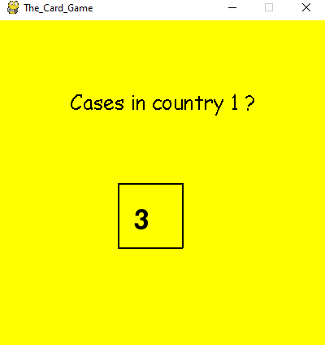
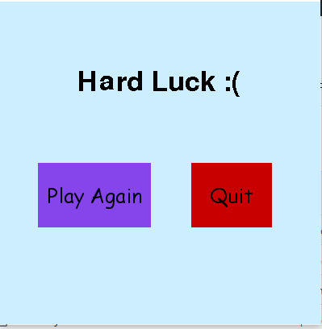

# CountTheCases

- In the times of the pandemic it is fun to play some games too. Here there are 8 countries affected COVID-19. The statistics will be displayed, can you remember them all?
- The game begins at Stage 1 and continues, till you choose to quit the game.
- In every stage the number of cases increase
- The countries are numbered from 1-8 from the top-left corner as :
        1 2 3 4
        5 6 7 8
- This is how the game looks

- The scripts run on the Python shell as this requires a graphical interface.
