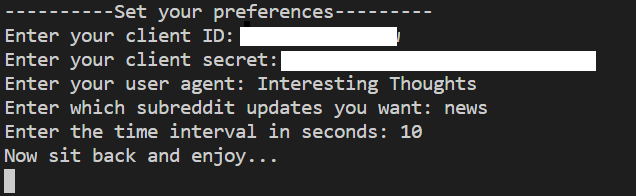
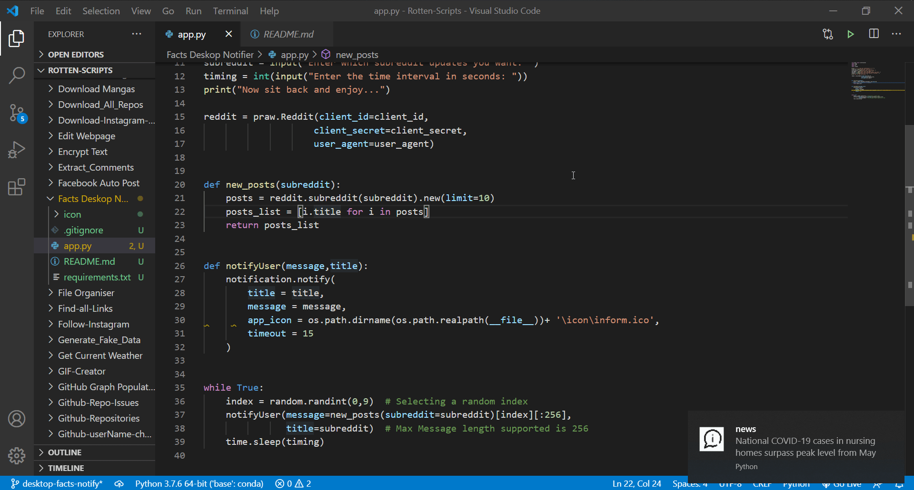

# Facts Deskop Notifier (Reddit Version)
This script fetches top 10 post from corresponding subreddit and then randomly selects one of them to be pushed to the notification area. The subreddit, time interval can be defined at the startup. 

# Tech Stack
- plyer (for notifications)
- praw (Python wrapper for Reddit)

# How to use script?
- For first time setup, in terminal:  ``pip install requirements.txt``
- Then after that:  ``python app.py``

# Working Demo:
For this configuration:

This would be output (GIF):

