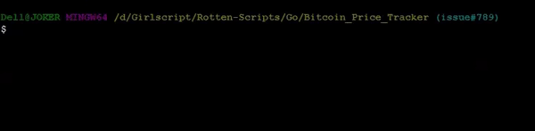

# Bitcoin_Price_Tracker

A script used to fetch the live price of 1 BTC in INR, written in GOlang. [Colly package](https://github.com/gocolly/colly) is used as a base for the web scraping and tag search.

- Fetches the live price of 1 Bitcoin.

## Setup instructions

After forking the repository and cloning on user system ,follow these commands on git bash/bash:
```
cd Rotten-Scripts/Go/Bitcoin_Price_Tracker
go build main.go
go run main.go
```

## Detailed explanation of script

The code uses **colly package** for scraping and **fmt package** for display.
The *main()* function calls the *give_current_price_of_bitcoin()* which calls an instance of colly's collector to scrape with a boolean based condition to exit out of the target
search.

## Output


