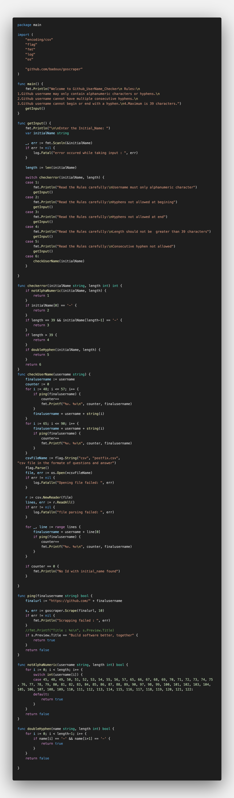

Github-UserName-Generator
=========================

|checkout|

This is Go script used to generate the possible UserName for Github.

Prerequisites:
--------------

Go

Process:
--------

.. code-block:: bash

    $ go get -u github.com/badoux/goscraper
    $ go run main.go

Author(s)
---------

Made by `WABLE SANKET <https://github.com/Sanketwable>`__.

.. |checkout| image:: https://forthebadge.com/images/badges/check-it-out.svg
   :target: https://github.com/HarshCasper/Rotten-Scripts/tree/master/Go/Github_UserName_Checker/

