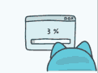

# Video/Images to GIF converter in golang

## Use [ffmpeg](https://ffmpeg.org/) before using script

### Steps to run:

    1. gitclone
    2. go install gifgen.go
    3. gifgen -s (image/video) -i (input path for images directory) - o (output path for generated gif)

