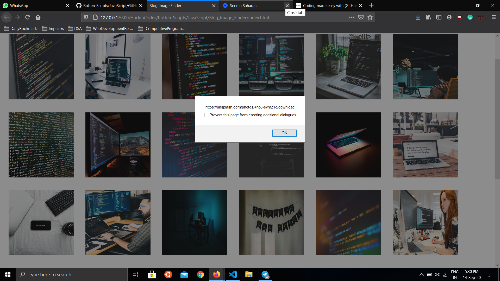

Script in JS used to get images
===============================

|checkout|

About
-----

Blogs are like caffeine for writers for which they always tries to find
interesting stuffs(images/quotes/GIFs) to encourage readers to read even
a long blog.Now, Blogs are of various genres, so it is very difficult
for a writes to get apt images to insert in their blog. So, I’ve
developed a script which is very much easy to use and which can find 20+
images instantly and also provides the link(Unsplash link).

Explanation of code
-------------------

-  unsplash API is used to fetch all `images <https://api.unsplash.com/search/photos?per_page=30&query=%5Bword%5D&client_id=%5Bkey%5D>`__

   -  An API key is required to use the API in your app, which can easily be obtained from `unsplash official website <https://unsplash.com/developers>`__.

-  Async/Await is used to consume promises.
-  Script is dependent on a basic boilerplate HTML file, which displays all the images retrieved by the script.
-  To get link of any image, just click on that, a pop-up/alert window with link will appear.

To run the code
---------------

-  Clone the folder
-  Inside the folder open index.html or in some editor you can use live-server to run HTML file.
-  Then search images of which category/genre you want.

Output
------

Author(s)
---------

Made by `Piyush Gupta <https://github.com/gupta-piyush19>`__.

.. |checkout| image:: https://forthebadge.com/images/badges/check-it-out.svg
   :target: https://github.com/HarshCasper/Rotten-Scripts/tree/master/JavaScript/Blog_Image_Finder/
