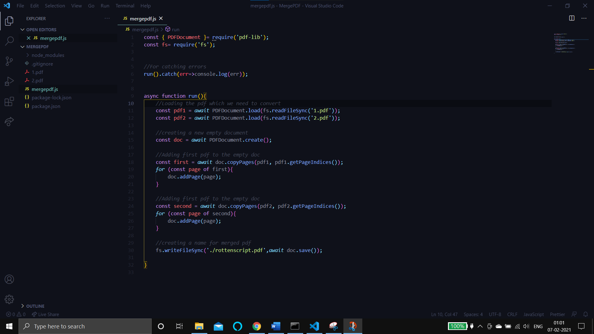
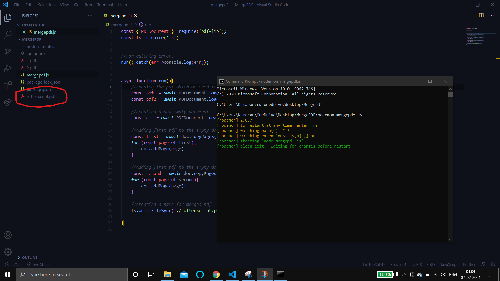

# Merging PDF

A Javascript Code that merge two pdf into single pdf with the help of pdf-lib library. First, this code will load pdf from the directory and then it creates new documents to add these loaded pdf into it.

# Before merging:

# After merging:

