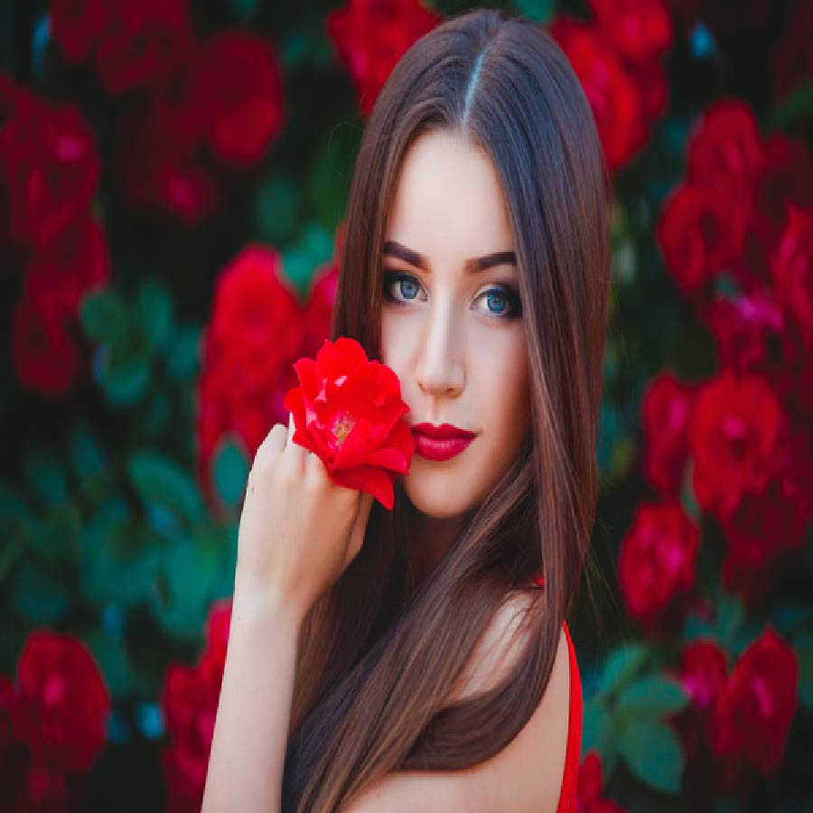

# Applying "Neon Effect Filter" on an image.

Converting an image into an neon effect filtered image using OpenCv, Os, Matplotlib and Numpy.

## Steps:
* Firstly imported the required libraries which are Numpy, Os, Matplotlib and Cv2.
* Taking path of the image/Real image as input using os and finally reading it using cv2

## Methods Used
* Used Bilateral Filter
* Followed by Median Blur
* Followed by Adaptive Threshold
* Followed by Bitwise "and" between original image and edge image
* And at last used Bitwise "xor" between orginal and output of the above "bitwise and image"
* Finally converted the image into "Neon Effect Filtered" image

## Original Image

## Neon Effect Filtered Image

