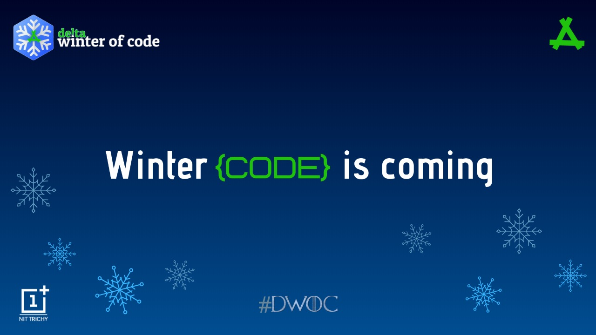

<h1 align="center"> Delta Winter of Code 2020</h1>

<h2> About DWOC'20 </h2>
Delta Winter of Code is a winter long program organised by Delta Force, the coding club of NIT Trichy. With an aim to support and improve the culture of open source software around us, this serves as a platform for young student developers (or even starters) to hone their technical skills by taking up projects of their interests. It encourages collabrative experiences and allows students from all backgrounds to contribute to quality technical projects from diverse fields.

  

