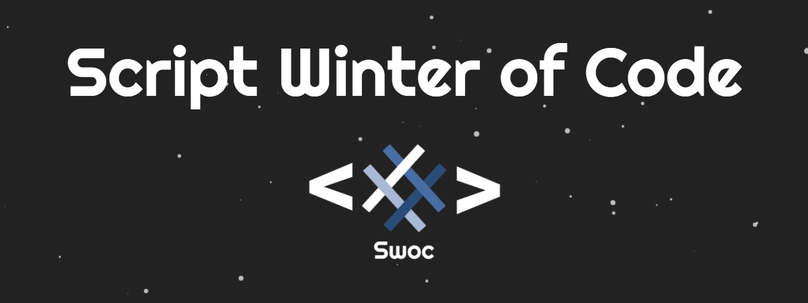

<h1 align="center"> Script Winter of Code (SWoC) </h1>

## About SWoC

Script Winter of Code is an **open-source** program envisioned by the **Script Foundation**. It aims to bring students into the world of **open source** development and see the power of unified problem-solving in real time. The projects that we will host have been carefully hand-picked to invigorate creative thinking and encourage collaboration among all participants.
The students will be guided by experienced mentors throughout their journey. They will learn the skills essential in the world of programming, all the while developing a deep appreciation for the world of open-source.

  

