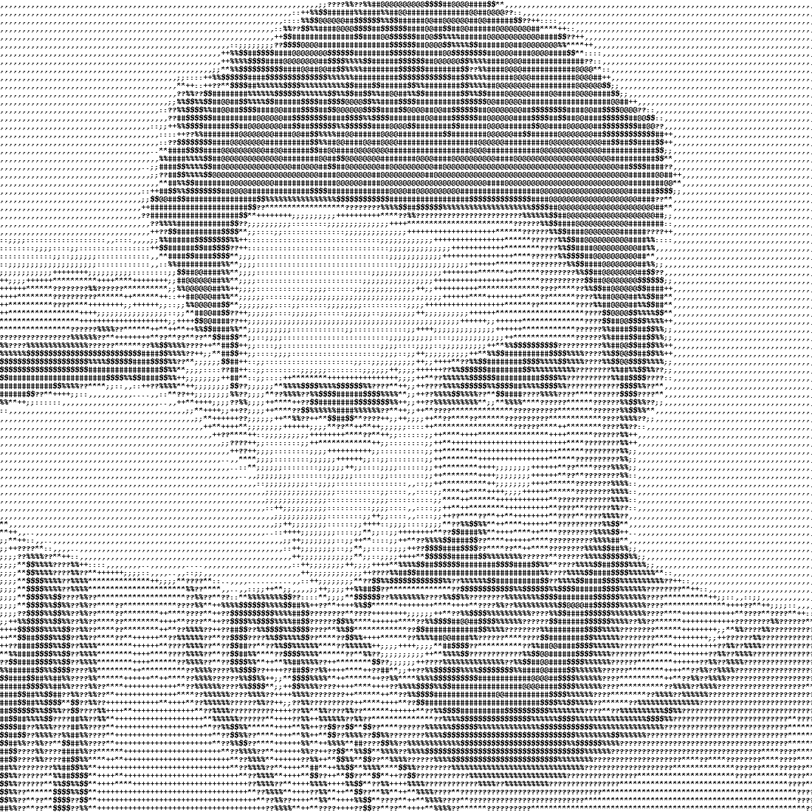

ASCIIfy your image
==================

|checkout|

This python script converts the input image to an ASCII version of
itself. This is achieved by giving a different range of grayscale values
to different special characters from the ASCII set. The whole image is
then converted based on this.

Setting up:
-----------

-  Create a virtual environment and activate it
-  Install the requirements

.. code:: bash

     $ pip install pillow

Running the script:
-------------------

.. code:: bash

     $ python asciify.py [image_path]  #without the brackets

Example running the script
--------------------------

.. code:: bash

     $ python asciify.py input.jpg  

Will be converted to
--------------------

.. |checkout| image:: https://forthebadge.com/images/badges/check-it-out.svg
  :target: https://github.com/HarshCasper/Rotten-Scripts/tree/master/Python/ASCIIfy_Image/

