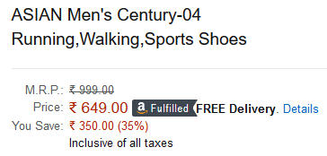
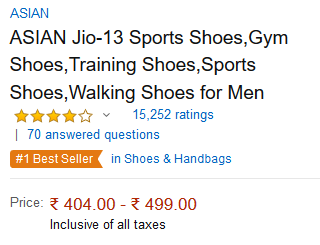
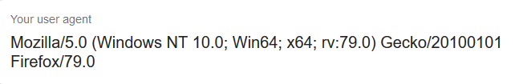
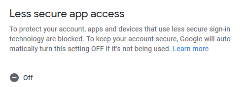
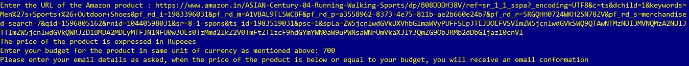
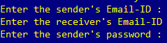
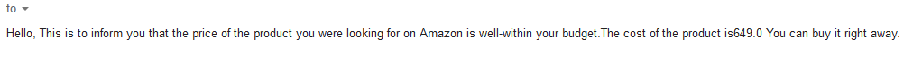
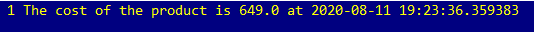

Amazon Price Tracker
====================

|checkout|

-  This script built in Python is an Amazon Price Tracker.
-  The user enters :

   -  The URL of the product of which he would like to track of the price.
   -  His/Her budget for the product.
   -  His/Her Email credentials.

-  The script runs continuously and checks on the price of the product every 12 hours.
-  If the price of the product is equal to or below the user’s budget, the user receives an email confirmation.
-  The price of the product is logged into a file named price_logger.txt every 12 hours.

Working and Usage
-----------------

-  The BeautifulSoup library is used to scrape the price of the product from the Amazon site.
-  On Amazon, the prices of products are either expressed as a range or as a single number.

-  If the budget is within the range, an email will be sent.
-  In the script, headers need to be used to make the get request to the Amazon site.
-  In place of headers, the user must replace it with the result of **my user agent** must be used instead.

-  The Email settings of the user must be configured to operate on less secure mode to facilitate the sending of emails.

-  After this, the script can be run.

-  Using this as an example

-  The user enters 700 rupees as the budget, as the price is lesser than the budget the following email is sent, else the program continues to run till the condition is satisfied.

-  The prices are also logged into the file price_logger.txt as shown, so the user will have an account of the changes the price underwent.

.. |checkout| image:: https://forthebadge.com/images/badges/check-it-out.svg
  :target: https://github.com/HarshCasper/Rotten-Scripts/tree/master/Python/Amazon_Product_Price_Tracker/

