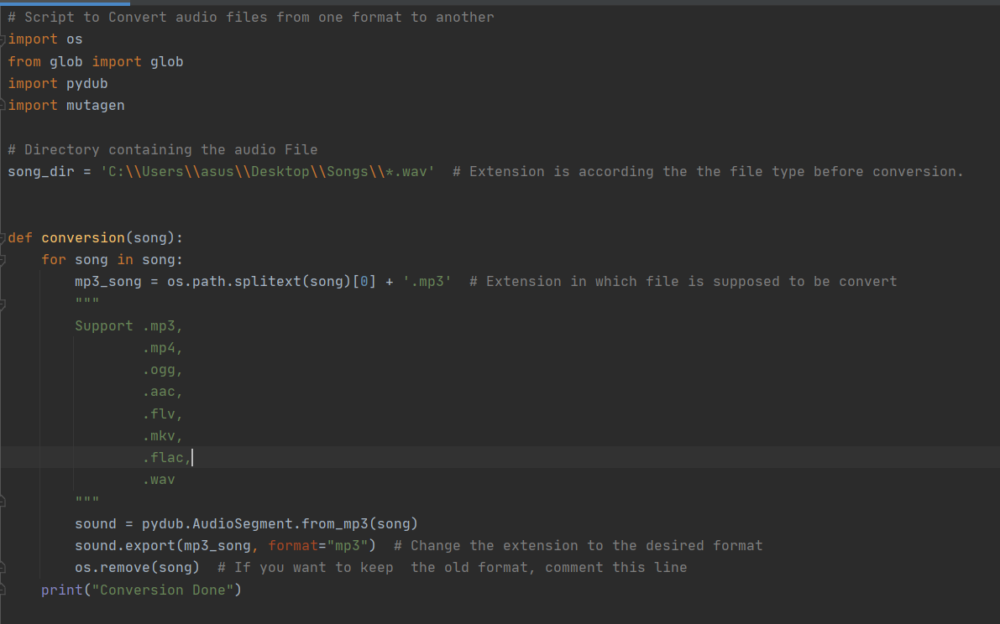
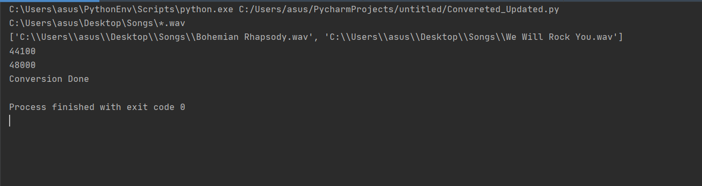

# Audio_Format_Converter

[](https://www.python.org/)

A simple Python Script that can be used to convert an Audio File in a given to format into another format, without
losing quality, sample rate, frequency etc.

There are 2 functions in the Script.
- conversion

&nbsp;&nbsp;&nbsp;&nbsp;&nbsp;&nbsp;&nbsp;&nbsp;&nbsp;&nbsp;&nbsp;&nbsp; This function converts the provided audio file
into a file with desired format. 
- parameters
&nbsp;&nbsp;&nbsp;&nbsp;&nbsp;&nbsp;&nbsp;&nbsp;&nbsp;&nbsp;&nbsp;&nbsp; This can be used to find the Sample Rate of 
the Audio file.

## Dependencies
 1. python3
 2. pydub
 3. mutagen

## Setup instructions

- Setup a Virtual Environment.
- Install the dependencies using ```pip3 install -r requiremnts.txt```
- You are all set and the [script](Audio_File_Converter.py) is Ready to run.
- Follow the Instructions already provided in the script.
- Carefully provide the *Keyboard Interrupt* in order to ensure that the required files are deleted only.

## Detailed explanation of script, if needed

While working on a research project based on Audio File Processing. I found that ```.wav``` and `.flac` are best for
Audio Processing. 

**The Problem?**

It is so easy to download `mp3` files but ```.wav``` and `.flac` are not easily available and considering there huge
file, downloading 100s of them are impractical also. Now there are online Audio Converter, but the problem of 
downloading huge files still remain, moreover such converter usually cause a dramatic loss in quality and that is not 
acceptable (at least for research purposes). Although the converter I made can be used for more than 10 file types.

So I decided to make my own File Converter for that purpose. Hope it will help you too.

## Output

Original Files - 


Script - 


Output - 


Files in Converted format - 


## Author(s)

Made by [Vybhav Chaturvedi](https://www.linkedin.com/in/vybhav-chaturvedi-0ba82614a/)
