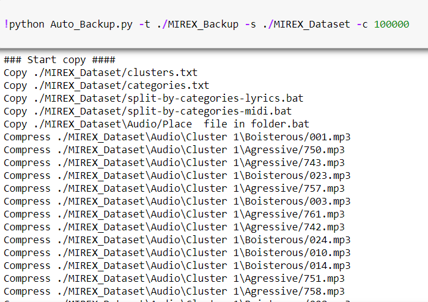
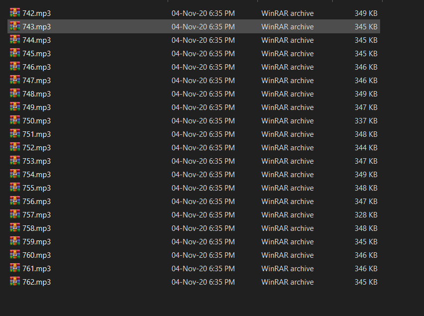
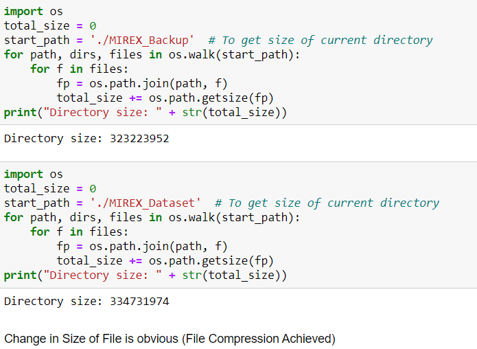

Automatic_Backup
================

|checkout|

Automatic Backup and Compression of large file, sped up using Threading.
Multithreading helps in achieving MultiTasking using threads.

Along with Multithreading ``gzip`` has been used for Compressing large
files. I have made sur that the script required no additional library
other than the basic standard packages.

Setup instructions
------------------

As explained there is no specific ``requirements.txt``. So no additional library or packages are required.

There are two files one ``python`` and one ``notebook``. `Auto_Backup.py <./Auto_Backup.py>`__ is the script that can be quickly used to backup the desired file.

For greater understanding of the script and proof of concept, refer to `Auto_Backup.ipynb <./Auto_Backup.ipynb>`__. The Notebook has further illustrated the Script and is much more detailed.

Example Usage - 

.. code-block:: bash

   python Auto_backup.py -t ./MIREX_Backup -s ./MIREX_Dataset -c 100000

Output
------

- Command line Input

- Directory Before Backup

- Directory After Backup

- Size Comparison after and before

Author(s)
---------

Made by `Vybhav Chaturvedi <https://www.linkedin.com/in/vybhav-chaturvedi-0ba82614a/>`__

.. |checkout| image:: https://forthebadge.com/images/badges/check-it-out.svg
  :target: https://github.com/HarshCasper/Rotten-Scripts/tree/master/Python/Auto_Backup/

