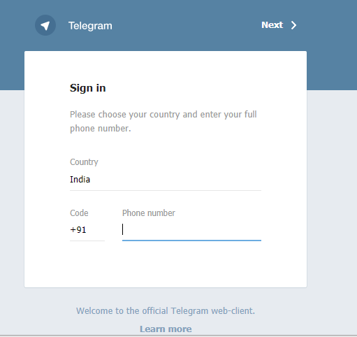
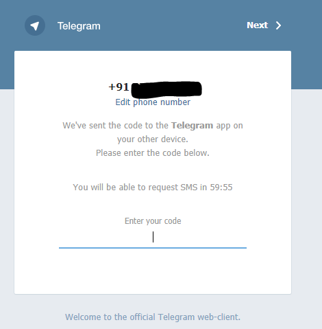
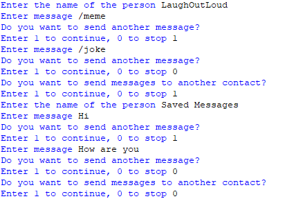

## Automate Telegram ##
- This script can be used to automate the process of sending messages in Telegram
- Here the process of automation is achieved by using the framework Selenium.
- Selenium is a portable framework for testing and automating web applications web applications

## Working ##

- The user is prompted to login and verify the phone number

- The user will receive a code which has to be entered

- After the verification process, the user can send messages to the contacts

- The user can send multiple messages to the same user

- The user can also send messages to multiple users

