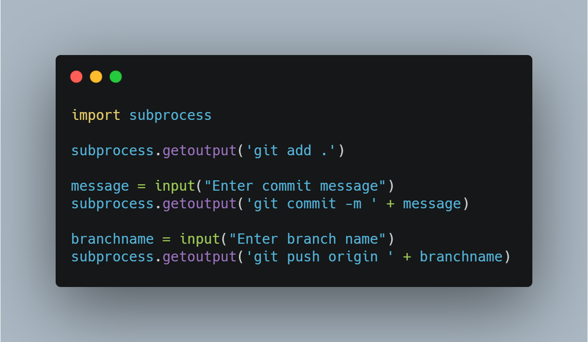

Automate commit using Git
=========================

|checkout|

.. figure:: https://steadylearner.com/static/images/post/Python/python-github-by-Steadylearner.png
   :alt: image

Are you tired of adding, committing and pushing you code everytime you
change it? If so, you can use this Python script to automate this boring
stuff. This code is the simplest one to automate the task.

Understanding the code
----------------------

.. code-block:: python

   import subprocess

- The subprocess module allows us to spawn processes, connect to their input/output/error pipes, and obtain their return codes.

   .. code-block:: python

      subprocess.getoutput('git add .')

*subprocess.getoutput:* Return output (stdout and stderr) of executing
cmd in a shell. That means, it will execute the command ``git add .``

   .. code-block:: python

      message = input("Enter commit message")

- Now, you can simply understand that we are taking an input message to give it to the commit message in the next command.

   .. code-block:: python

      subprocess.getoutput('git commit -m ' + message)

- In this line of code, we can see that the commit message will be appended to the command ``git commit -m <message>``.

   .. code-block:: python

      branchname = input("Enter branch name")

- Then, give the branch name to which you want to push your code.

   .. code-block:: python

      subprocess.getoutput('git push origin ' + branchname)

- Finally, to push our code we are using,
  
   .. code-block:: bash
  
      git push origin <branch-name>

- You can also add a variable to the remote url for defining the origin, but by default it is origin.

.. |checkout| image:: https://forthebadge.com/images/badges/check-it-out.svg
  :target: https://github.com/HarshCasper/Rotten-Scripts/tree/master/Python/Automate_Commiting_Using_Git/

