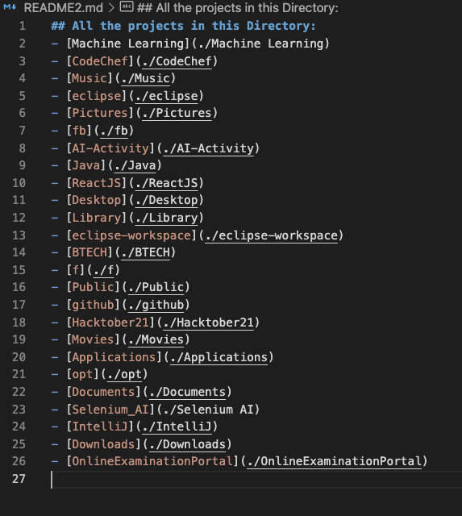
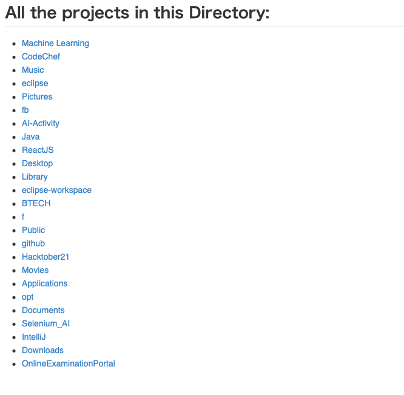

## Automated README generator ##
- This script can be used to update README.md file when there is a new project added to the repository automatically with just a single execution.


#### Work Flow
- Getting all the list of directories in the current working directory.
- Creating the README.md file
- Adding all the directory name to README.md and linking to its location.

### Generated README file:
##### raw file


##### preview image



###  Run the scripts using 
    ```
      python i_am_bored.py
    ```


Happy coding 🤟