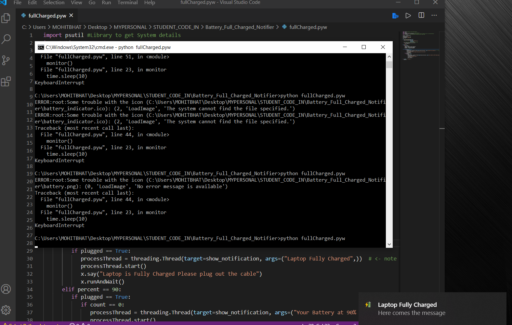

Battery Full Charged Notifier
=============================

|checkout|

As a laptop user you must take caution about your battery because the
battery is also the most important component If you are using an old
laptop then you might be a wonder to protect your battery from getting
overcharged! This Python script helps you to get a notification, when
your laptop get 100% charged. This script can run in background or you
can paste it in startup folder so that everytime you open your laptop,
this script starts running automatically

**In this code I have also made script to notify you when battery is 90%
charged and plugged, you can remove it, if you don’t want that part**

To run the code
---------------

-  Clone the folder- Battery_Full_Charged_Notifier
-  You must have python installed
-  In cmd do:

   -  pip install psutil
   -  pip install pyttsx3
   -  pip install win10toast
   -  Also check for any package that’s need to be installed, on cmd
   -  then run by typing **python python
      battery_full_charged_notifier.pyw**

**Note after running successfully for first time, you can then run by
just double clicking on the script, like to run as a program**

Explanation of code
-------------------

-  We have used python libraries like psutil to get information about
   the system, this is the package that gives information about battery.
-  Also we are using pyttsx3 module to give a sound notification
   regarding the battery along with the popup notification
-  win10toast is used to create the notification, that is what you see
   normally in our Pc’s

Output
------

   image

Made by `Mohit Bhat <https://www.mbcse.co>`__

.. |checkout| image:: https://forthebadge.com/images/badges/check-it-out.svg
  :target: https://github.com/HarshCasper/Rotten-Scripts/tree/master/Python/Battery_Full_Charged_Notifier/

