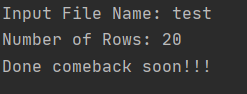
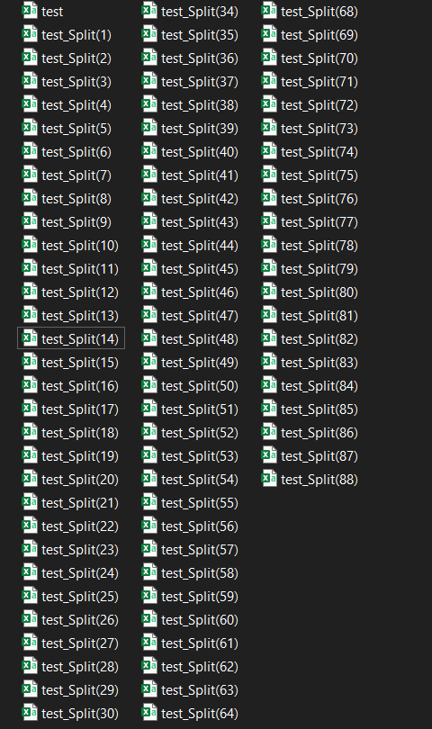
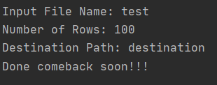
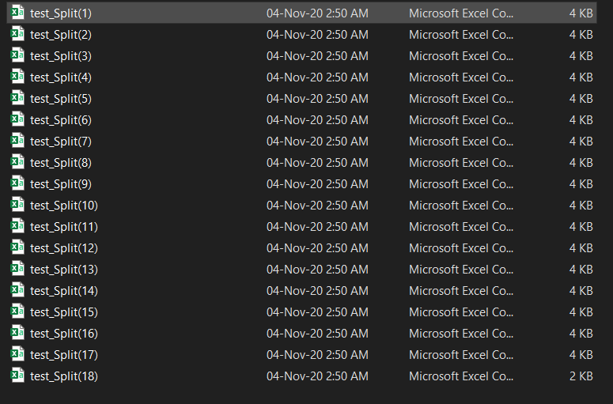
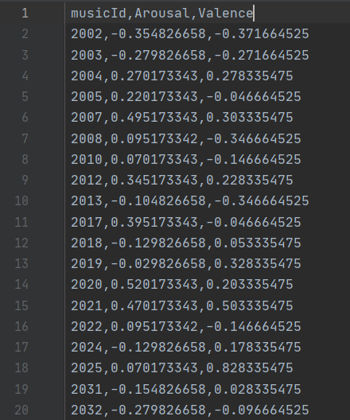

CSV Splitter
============

|checkout|

A basic Python script that can split a ``.csv`` into multiple files
according to user preference.

Setup instructions
------------------

Just make sure you have the CSV with you :) All the Steps have been
properly mentioned as comments.

::

   Example Usage - 

   >python csv_splitter.py

   >Input File Name: test
   >Number of Rows: 500
   >Done comeback soon!!!

   OR

   >python csv_splitter.py

   >Input File Name: test
   >Number of Rows: 100
   >Destination Path: destination
   >Done comeback soon!!!

Output
------

|Input Image| upto 1745 rows

Command Line Argument (No destination path given) -

With Destination Path -

Author(s)
---------

Made by `Vybhav Chaturvedi <https://www.linkedin.com/in/vybhav-chaturvedi-0ba82614a/>`__

.. |checkout| image:: https://forthebadge.com/images/badges/check-it-out.svg
  :target: https://github.com/HarshCasper/Rotten-Scripts/tree/master/Python/CSV_Splitter/

