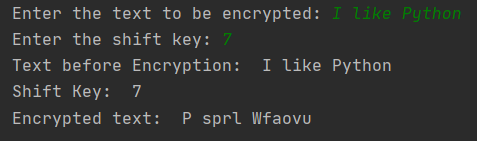
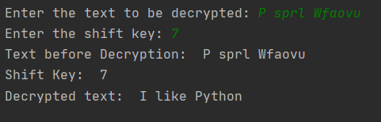

Caesar Cipher
=============

|checkout|

Caesar Cipher or *Shift Cipher* is one of the most basic and one of the
first cryptographical approach ever used. Named after the famous Roman
Ruler **Gaius Julius Caesar** the roots of this technique are very very
old.

The technique is really simple, a secret key (a number) is shared
between the sender and receiver, and in order to encrypt the message.
The letters are substituted by another letter by a fixed number of
position down the alphabets. This Shift is determined using the shared
key, opposite is done to determine the actual message.

For Example: Upon giving a shift key of 2, A would be replaced by C, B
by D and so on.

Setup instructions
------------------

There are 2 scripts.
- `cipher.py <./cipher.py>`__: This Script is used to encrypt a human readable message into a secure string.
-  `decipher.py <./decipher.py>`__: This Script is used to decrypt a secure string message into a human readable.

Output
------

Sample Outputs -

-  cipher.py
   >Enter the text to be encrypted: Manchester is BLUE
   >Enter the shift key: 5
   >Text before Encryption: Manchester is BLUE
   >Shift Key: 5
   >Encrypted text: Rfshmjxyjw nx GQZJ

-  decipher.py
   >Enter the text to be decrypted: Rfshmjxyjw nx GQZJ
   >Enter the shift key: 5
   >Text before Decryption: Rfshmjxyjw nx GQZJ
   >Shift Key: 5
   >Decrypted text: Manchester is BLUE

Author(s)
---------

Made by `Vybhav Chaturvedi <https://www.linkedin.com/in/vybhav-chaturvedi-0ba82614a/>`__

.. |checkout| image:: https://forthebadge.com/images/badges/check-it-out.svg
  :target: https://github.com/HarshCasper/Rotten-Scripts/tree/master/Python/Caesar_Cipher/

