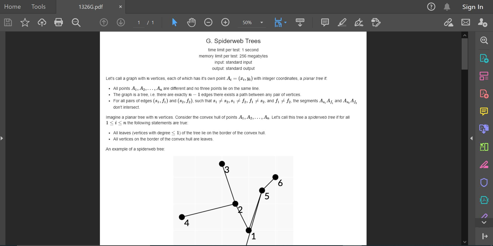

# Save any problem you like from CodeForces as a pdf

This python script will download problem statement from CodeForces and save them as a pdf file. The script uses Selenium Webdriver and fpdf library. Selenium is used with Chrome Webdriver, so having Chrome browser is a requirement.

## Setting up:

- Create a virtual environment and activate it.

- Install the requirements

```sh
  $ pip install -r requirements.txt
```
- Check if the path of chromedriver.exe in the script points to the right place according to your local system.

## Running the script:

```sh
  $ python find_codeforces.py [problem_code]  #without the brackets
```

## Example running the script :

```sh
  $ python find_codeforces.py 1326G
```

The program will ask you to enter a filename(without '.pdf'). The pdf will be created in the same folder.


