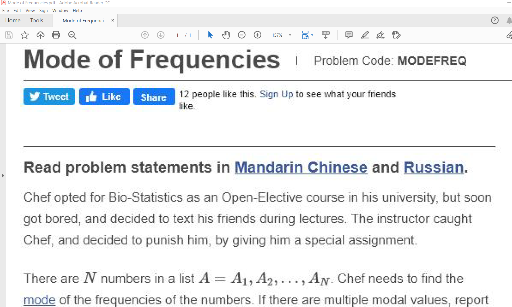

Codechef Problem Scrapper
=========================

This script takes a problem code from the user and fetches the related
problem from the codechef website and stores the problem statement in a
text file.

How to use this script?
-----------------------

You will need the following things to be able to use it:

1. Chrome Browser

2. Chromedriver according to the version of your chrome browser.Put this
in the same directory as your script.

3. Some external python libraries which you can get by running the
following command:

``pip install -r requirements.txt``

4. And yes, a stable internet connection too.

After fulfilling the above necessities run the following command:

``python3 codechef_problem_solver.py``

It will request a problem code from you.

Type your problem code and see the script in action.

A sample text file generated using this script:
-----------------------------------------------

.. |checkout| image:: https://forthebadge.com/images/badges/check-it-out.svg
  :target: https://github.com/HarshCasper/Rotten-Scripts/tree/master/Python/Codechef_Problem_Scrapper/

