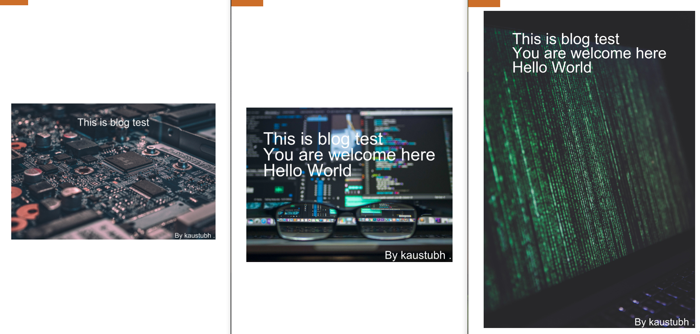

Customised Blog Headers
=======================

|checkout|

This script generates images for tech blogs. Just give the image choice,
author name you want and the content you want to display on the image.

How to use?
-----------

.. code-block:: bash

   python app.py img_no author_full_name title_to_be_displayed

-  Author Full Name: It consist of first name and last name. If you
   don’t want to use full name then put a ‘.’ after your first name.

-  Title to be displayed: First image has capacity of about 8 words per
   line and remaining images have about 6 words per line. To display
   multiple lines, put ‘/n’ between the lines. See the example below for
   reference

-  Choices of Images are, just put the image number in the script:

   -  Image 1: |image0|

   -  Image 2: |image1|

   -  Image 3: |image2|

-  Examples:

   -  ``python app.py 1 kaustubh . This is blog test``

   -  ``python app.py 2 kaustubh . This is blog test/nYou are welcome here/nHello World``

Requirements
------------

.. code-block:: bash

   pip install Pillow, opencv-python

Example Screenshot
------------------

|image3|

Link of Images (Unsplash):
--------------------------

-  `Kevin Ku <https://unsplash.com/photos/w7ZyuGYNpRQ>`__
-  `Alexandre Debiève <https://unsplash.com/photos/FO7JIlwjOtU>`__
-  `Markus Spiske <https://unsplash.com/photos/68ZlATaVYIo>`__

.. |image0| image:: raw_img/img1.jpg
.. |image1| image:: raw_img/img2.jpg
.. |image2| image:: raw_img/img3.jpg

.. |checkout| image:: https://forthebadge.com/images/badges/check-it-out.svg
  :target: https://github.com/HarshCasper/Rotten-Scripts/tree/master/Python/Customized_blog_headers/

