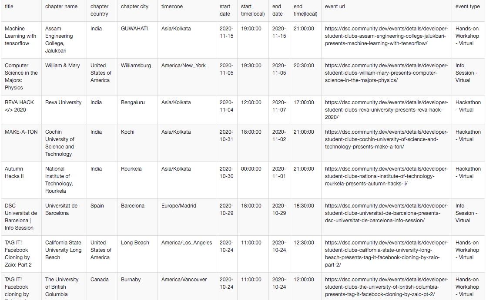

# Scrape events from Developer Students Clubs website
- Scrapes events from https://dsc.community.dev/
- Stores event list in a file called `data.csv`
- uses modules `requests`,`csv`, `sys`
- This script uses API to get JSON data and parses the data to get events and store in a csv file

## Sample output file
