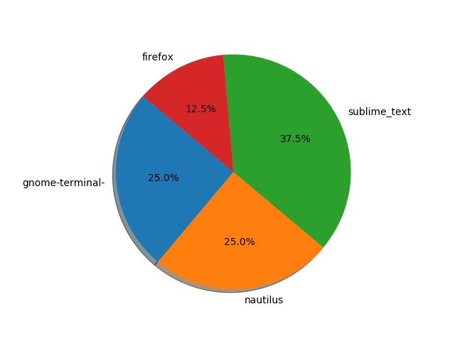

Time Tracker
============

|checkout|

Description
-----------

This script is written in python and can be used to track user time used
on Desktop Applications in a pie chart format \* The script is mainly
built using `xdotool <https://www.freebsd.org/cgi/man.cgi?query=xdotool&apropos=0&sektion=1&manpath=FreeBSD+8.1-RELEASE+and+Ports&format=html>`__

Language
--------

- Python

Installation
------------

.. code:: bash

   $ sudo apt-get install xdotool
   $ pip install -r requirements.txt

Usage
-----

Run

.. code:: bash

   python time_tracker.py

The outpus should be in script directory:

.. |checkout| image:: https://forthebadge.com/images/badges/check-it-out.svg
  :target: https://github.com/HarshCasper/Rotten-Scripts/tree/master/Python/Desktop_Time_Tracker/

