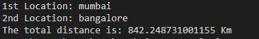

# Distance Calculating App
This app calculates distance between two geo-locations.

# Quick Start:
- Clone this repository.

      git clone https://github.com/HarshCasper/Rotten-Scripts.git
      
- Change Directory

      cd .\Rotten-Scripts\
      cd Python
      cd .\Distance-Calculator-App\
      
- Install requirememnts

      pip install requirements.txt
      
- Run python file

      python main.py
      
# Screenshot

# Author
[Aayush Garg](https://github.com/Aayush-hub)
