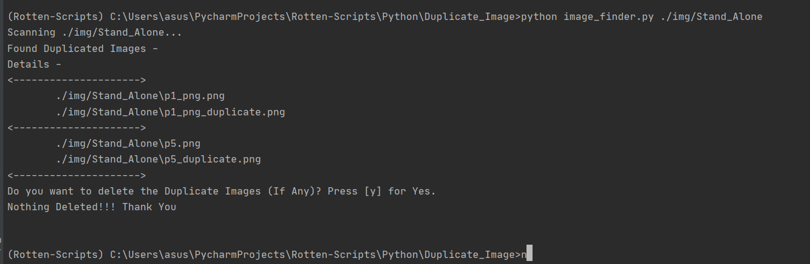
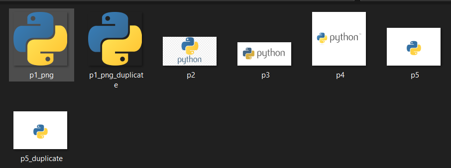
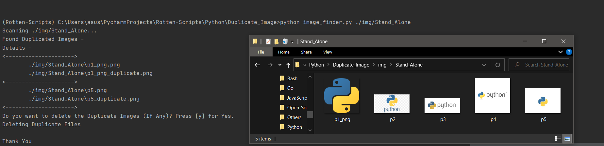
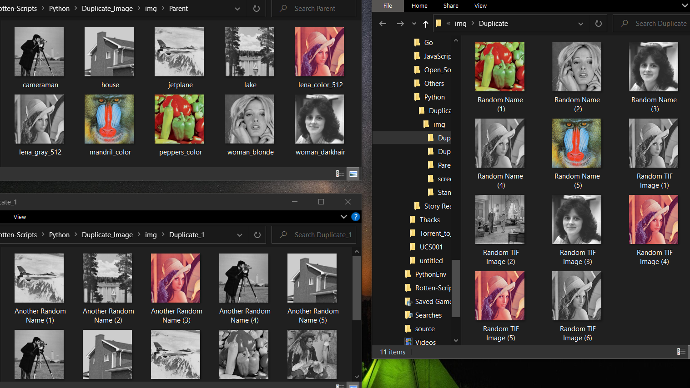
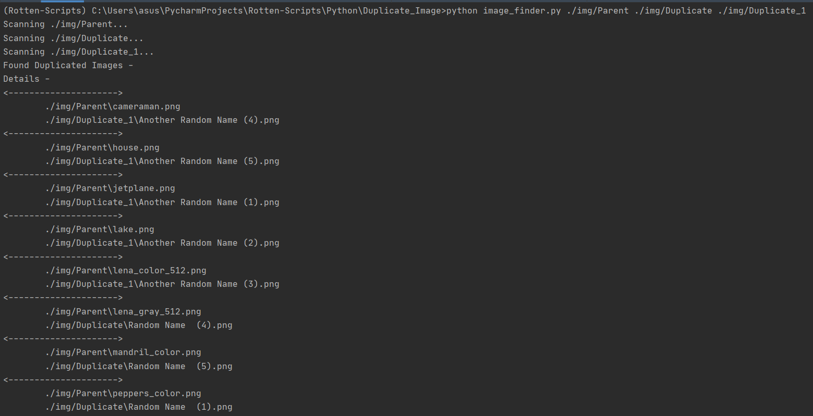
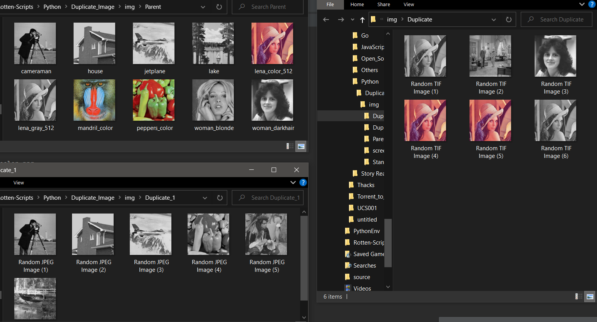

Duplicate Image Finder
======================

|forthebadge made-with-python| |checkout|

Many a time, we find duplicate images residing in our Albums,
Image_directory, etc, there are various reasons, downloading the same
file from various sources, auto backup on the cloud, it slipped out of
our mind that we downloaded it already in the first place, etc. Manually
selecting them is actually a hassle, but why do such a boring task when
automation can do the trick. This sweet and simple script helps you to
compare various files (not only images) in a directory, find the
duplicate, list them out, and then even allows you to delete them.

**Sweet!!!**

Setup
-----

-  Setup a ``python 3.x`` virtual environment.
-  ``Activate`` the environment
-  Install the dependencies using ``pip3 install -r requiremnts.txt``
-  You are all set and the `script <image_finder.py>`__ is Ready to run.
-  Clearly Follow the Instructions provided in the comments.

Usage
-----

In Command Line Interface, Run the script using -

``python image_finder.py <path of folder1, path  of folder2, .....>``

       1. folder1 - *Parent Folder*

       2. folder2, folder3 …. - *Subsequent Folders*

-  This acts as a reference for duplicate files, i.e. this contains the original copy, hence no file is deleted from this folder.
-  Comparisons are done with in the folder, and from Parent to Subsequent Folders.

Dependencies
------------

1. python3
2. keyboard

Detailed explanation
--------------------

The Script works on a simple fundamental. Two files with same `md5checksum <https://en.wikipedia.org/wiki/MD5>`_ will have similar contents. So in the script all we aim to do is determine the checksum, compare and find the duplicates.

Folder Structure
----------------

-  `Stand_Alone `__ folder has 6 images, 2 of them are duplicate of images within the folder only.
-  `Parent `__ contains standard images used for Image Processing in *png* format.
-  `Duplicate `__ folder contains 5 images duplicate of images in Stand_Alone (named ``Random Name (n)``). There are similar images in *tiff* extension as well, They are not Duplicate as file type is different.
-  `Duplicate_1 `__ folder contains another 5 images duplicate of images in Stand_Alone (named ``Another Random Name (n)``). There are similar images in *jpeg* extension as well, They are not Duplicate as file type is different.

Output
------

-  Running Script on a single folder ``Stand_Alone``. In this example I pressed [n] in order to not to delete anything.

-  Stand_Alone folder Before Deleting the files.

-  After Deleting the Files, i.e. Pressing [y] at the prompt.

-  ``Parent``, ``Duplicate``, ``Duplicate_1`` folder before running the
   script.

-  Running the scripts on the Folder and deleting the duplicate files.

.. figure:: img/screen/Duplicate2.PNG
   :alt: Pasting the Magnet Link

-  Final Result, Notice that all the files in ``Parent`` Folder remain as it is. Also notice that similar files but wth different extensions are not deleted, cause technically they aren’t same.

Author(s)
---------

Made by `Vybhav Chaturvedi <https://www.linkedin.com/in/vybhav-chaturvedi-0ba82614a/>`__

Check `Rotten Scripts <https://github.com/HarshCasper/Rotten-Scripts>`__ for more explanation and Implementation

.. |forthebadge made-with-python| image:: http://ForTheBadge.com/images/badges/made-with-python.svg
   :target: https://www.python.org/
.. |checkout| image:: https://forthebadge.com/images/badges/check-it-out.svg
  :target: https://github.com/HarshCasper/Rotten-Scripts/tree/master/Python/Duplicate_Image/

