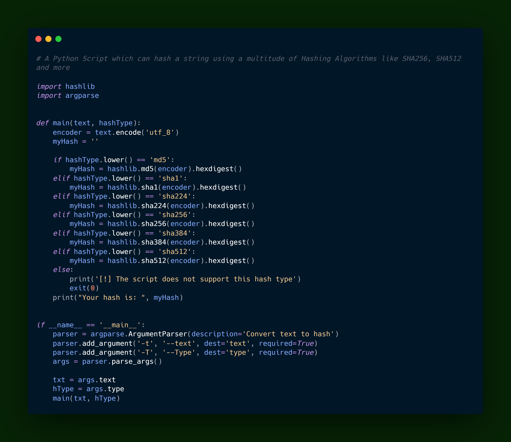

Encrypt Text
============

|checkout|

This is a Python Script which can hash a string using a multitude of
Hashing Algorithms like SHA256, MD5, SHA512 and more.

.. |checkout| image:: https://forthebadge.com/images/badges/check-it-out.svg
  :target: https://github.com/HarshCasper/Rotten-Scripts/tree/master/Python/Encrypt_Text/

