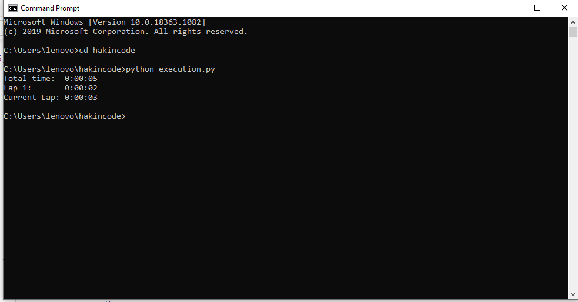

## Execution time of task
 Script to check how long task is running.

## How to use
From stopwatch.py import Stopwatch class in your code 
Execution.py contains the source code to run stopwatch.py
# How to execute execution.py
On the terminal type,
python execution.py

# screenshot of execution.py output
 
