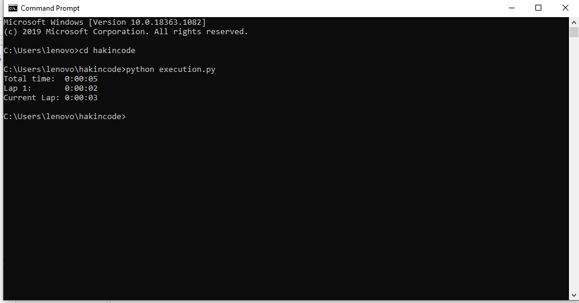

Execution time of task
======================

|checkout|

Python Script to check how long task is running.

How to use
----------

stopwatch.py contains Stopwatch stimulator having different functions
like start ,stop ,reset and lap. It will generate summary.

Modules used
------------

time
----

time function of time module is used Python time method ``time()``
returns the time as a floating point number expressed in seconds since
the epoch.

datetime
--------

timedelta function is used Python ``timedelta()`` function is present
under datetime library which is generally used for calculating
differences in dates and also can be used for date manipulations in
Python.

Sample code to execute stopwatch.py
-----------------------------------

.. code-block:: python

   import time
   from stopwatch import Stopwatch
   myStopwatch = Stopwatch()

   myStopwatch.start()
   time.sleep(2)
   myStopwatch.lap()
   time.sleep(3)
   myStopwatch.stop()
   print (myStopwatch.summary)

screenshot of output of above code
----------------------------------

.. |checkout| image:: https://forthebadge.com/images/badges/check-it-out.svg
  :target: https://github.com/HarshCasper/Rotten-Scripts/tree/master/Python/Execution_time/
