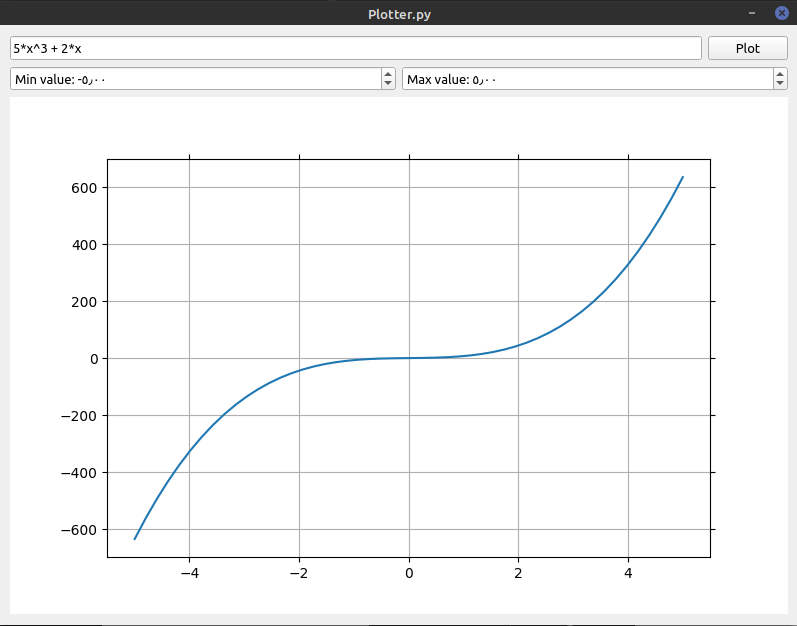
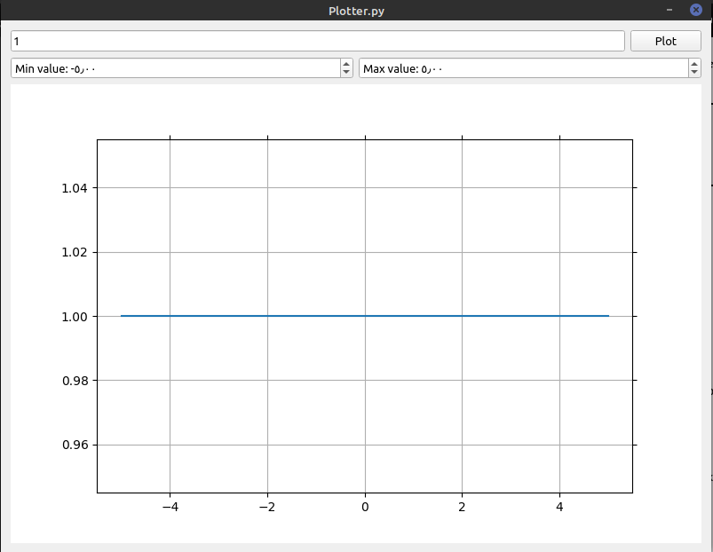
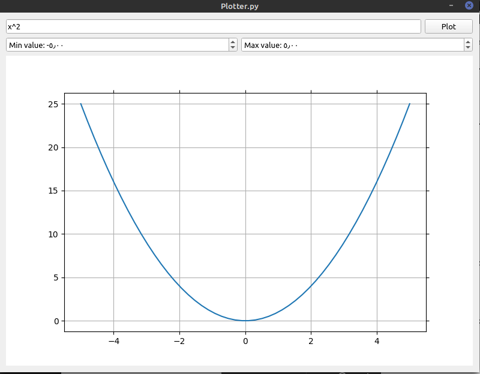
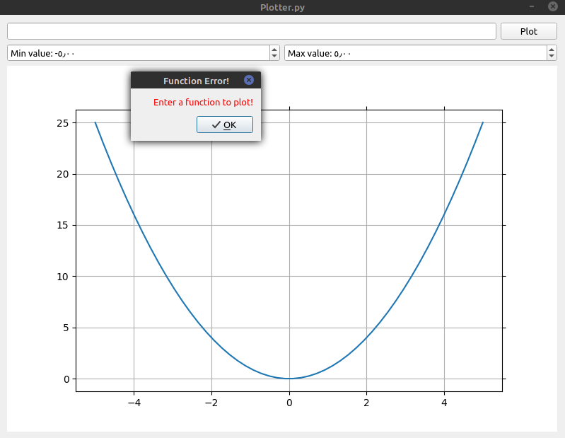
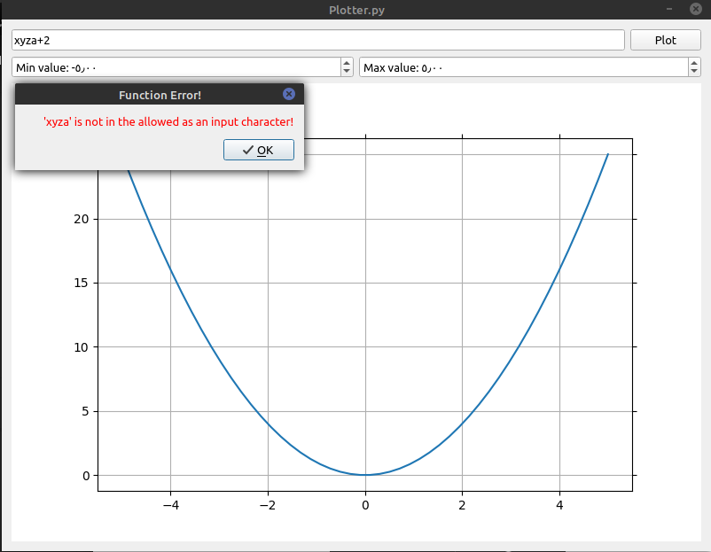
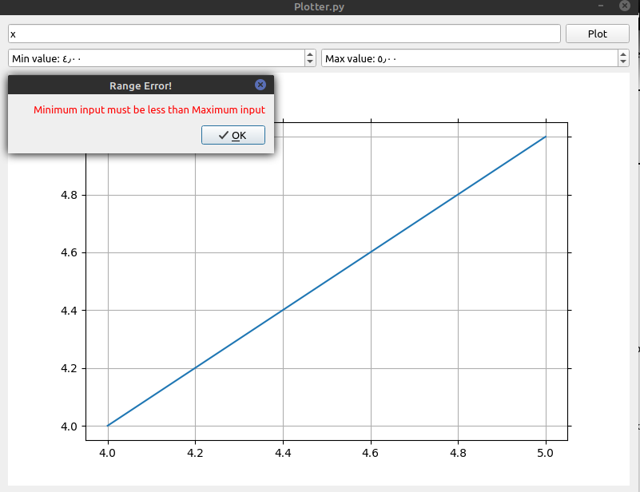
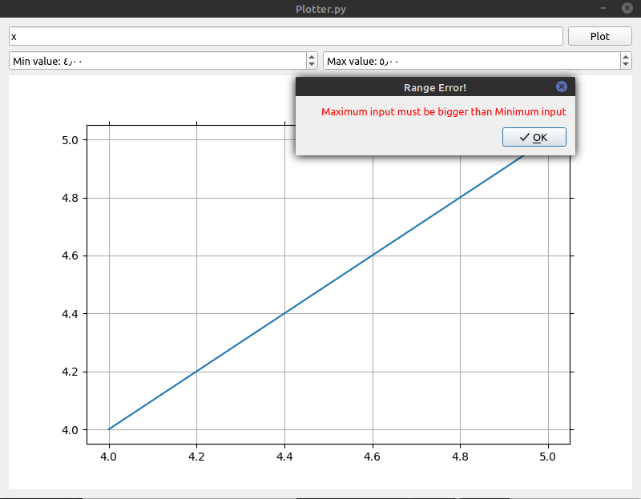

# Function Plotter

A GUI based program that plots an entered mathmatical function on a Matplotlib figure. It was built using Pyside2.

## Install

> `pip3 install -r requirements.txt`

## Usage

> `python3 Plotter.py`

* Enter a mathematical x-function.
* Click plot to view the output.
* Change x values range as desired.

## Working Examples

* ### Valid X-Function

* ### Constant Function

* ### Quadratic Function

## Wrong Examples

* ### Empty Fucntion

* ### Invalid Function

* ### Min Range > Max Range

* ### Max Range < Min Range

