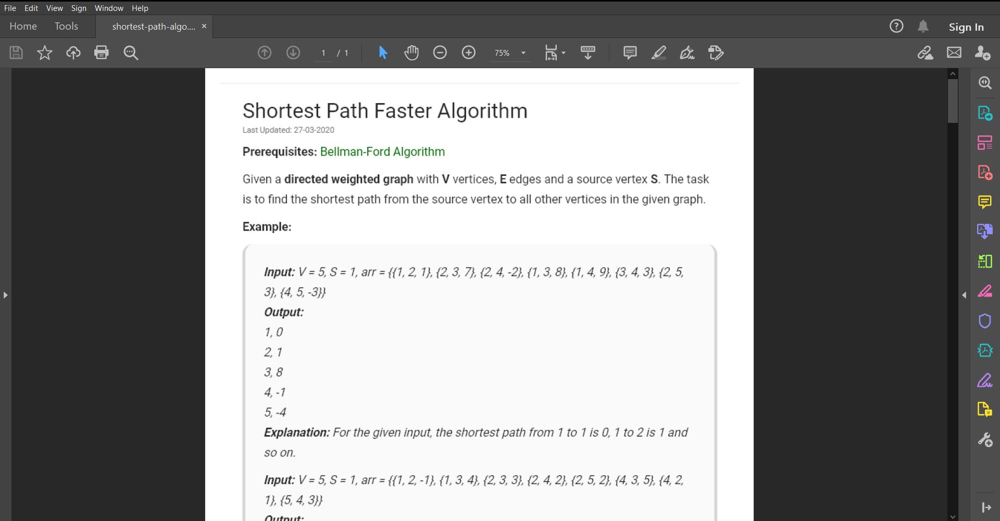

Save any article you like from GeeksForGeeks as a pdf
=====================================================

|checkout|

This python script will download articles from GeeksForGeeks and save
them as a pdf file. The script uses Selenium Webdriver and fpdf library.
Selenium is used with Chrome Webdriver, so having Chrome browser is a
requirement.

Setting up:
-----------

-  Create a virtual environment and activate it.
-  Install the requirements

.. code:: sh

     $ pip install -r requirements.txt

Running the script:
-------------------

.. code:: sh

     $ python geeksforgeeks_article_downloader.py [url]  #without the brackets

Example running the script :
----------------------------

.. code:: sh

     $ python geeksforgeeks_article_downloader.py https://www.geeksforgeeks.org/shortest-path-faster-algorithm/?ref=leftbar-rightbar

The program will ask you to enter a filename(without ‘.pdf’). The pdf
will be created in the same folder.

.. |checkout| image:: https://forthebadge.com/images/badges/check-it-out.svg
  :target: https://github.com/HarshCasper/Rotten-Scripts/tree/master/Python/GeeksForGeeks_Article_Downloader/

