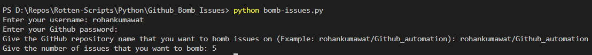

Bomb Issues on a Github Repository
==================================

|checkout|

This python script bombs specified number of issues on a Github Repository.

Libraries used:
---------------

1. PyGithub
2. os
3. getpass

How to use the script?
----------------------

1. Open terminal or command prompt.
2. Go to the directory.
3. Run ``python bomb-issues.py``.

A demo
------

.. |checkout| image:: https://forthebadge.com/images/badges/check-it-out.svg
  :target: https://github.com/HarshCasper/Rotten-Scripts/tree/master/Python/Github_Bomb_Issues/

