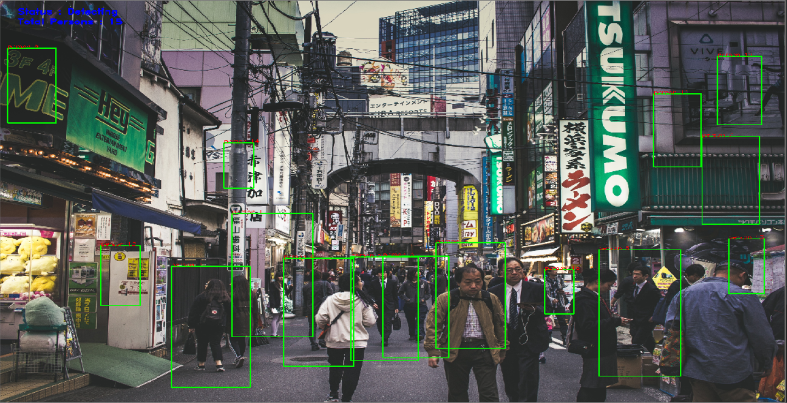

Human_Detector
==============

|checkout|

A really basic (boilerplate) code for Human_detection using OpenCV. The
script ``human_detector.py`` is the Wrapper around, ``HOG-SVM`` model
already implemented in OpenCV.

.. note::

   The aim of the script is not Accuracy, but ease of usability.

Dependency
----------

-  OpenCV
-  Numpy
-  Imutils
-  Jupyter and associated packages.

These are summarised in ``requirement.txt``

Setup
-----

1. A virtual environment (recommended)
2. ``pip install -r requirements.txt``
3. Open the `Jupyter Notebook <human_detector.ipynb>`__.
4. The Steps, details and guidelines can be found in comments.

Output
------

-  Using Images

|image0|

-  Using Video

|image1|

Disclaimer
----------

-  I have used the most basic SVM Histogram, as it is simple to implement.
-  Accuracy is not the Aim
-  The Script is as simple as it can be

Author(s)
---------

Made by `Vybhav Chaturvedi <https://www.linkedin.com/in/vybhav-chaturvedi-0ba82614a/>`__

.. |image1| image:: asset/output_video.gif

.. |checkout| image:: https://forthebadge.com/images/badges/check-it-out.svg
  :target: https://github.com/HarshCasper/Rotten-Scripts/tree/master/Python/Human_Detector/

