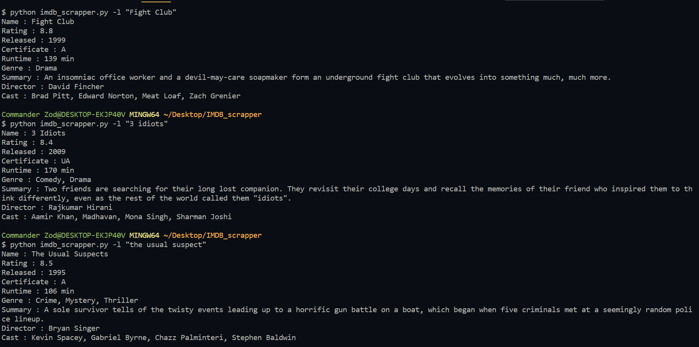

IMDB Scrapper
=============

This script takes a movie name as input and returns the information
about that movie.

Requirements for this script:
-----------------------------

1. BeautifulSoup4
2. requests

install these two by running the following command:

.. code-block:: bash
   
   pip install -r requirements.txt

How to use this script?
-----------------------

Just type the following in your command prompt:

.. code-block:: bash

   python imdb_scrapper.py -l

Sample of the script in action:
-------------------------------

.. |checkout| image:: https://forthebadge.com/images/badges/check-it-out.svg
  :target: https://github.com/HarshCasper/Rotten-Scripts/tree/master/Python/IMDB_scrapper/

