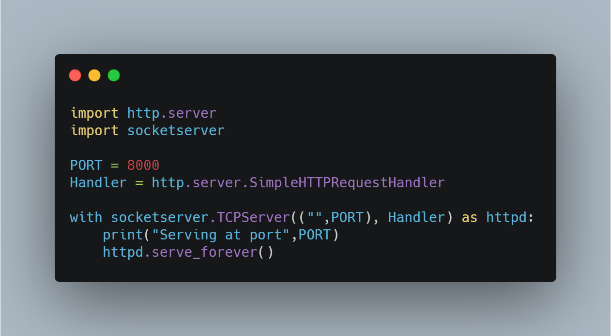
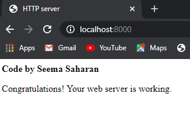

Initializing a HTTP Server(Web Server)
======================================

|checkout|

In every day life you are using web servers everywhere, even when you
visit a website like Flipkart, Amazon, or Google. Ever wondered what
is a web server and how it works?
Let me tell you what a web server does?
A HTTP Web Server is nothing but a process that is running on your
machine/laptop and does two things:

1. **Listen** : For incoming http requests on a specific TCP socket address (IP address and Port number).
2. **Handles** : Handles this request and sends a response to the user.

.. figure:: https://hackernoon.com/drafts/jot3yv6.png
   :alt: image

**Python Version used: 3.8.0**

Code
----

Explanation of the Code
-----------------------

-  To create HTTP server we need two modules: **http.server**, **socketserver**
-  **PORT** stores the value of **8000**, then the server will be listening on incoming requests on that port.
-  To handle the requests and send the response to the user. A **simple HTTP request handler** that serves files from the current directory and any of its subdirectories.
-  socketserver.TCPServer: TCPServer describes a server that uses the TCP protocol to send and receive messages.
-  For TCP server to instantiate, we need: 1. TCP address (IP address, Port number) 2. Handler
-  **serve_forever** is a method on the TCPServer instance that starts the server and begins listening and responding to incoming requests.

To run the code
---------------

.. code-block:: bash

   $ python initialize_http_server.py

Output of the code
------------------

.. |checkout| image:: https://forthebadge.com/images/badges/check-it-out.svg
  :target: https://github.com/HarshCasper/Rotten-Scripts/tree/master/Python/Initialize_HTTP_Server/

