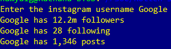

Instagram Scraper using BeautifulSoup
=====================================

|checkout|

This script is written in Python. It takes the username as input and
return the number of posts, followers and following. BeautifulSoup, a
web-scraping framework built on Python is used to get the required
information

.. |checkout| image:: https://forthebadge.com/images/badges/check-it-out.svg
  :target: https://github.com/HarshCasper/Rotten-Scripts/tree/master/Python/Instagram_Followers_Following_Scraper/Using_BeautifulSoup/

