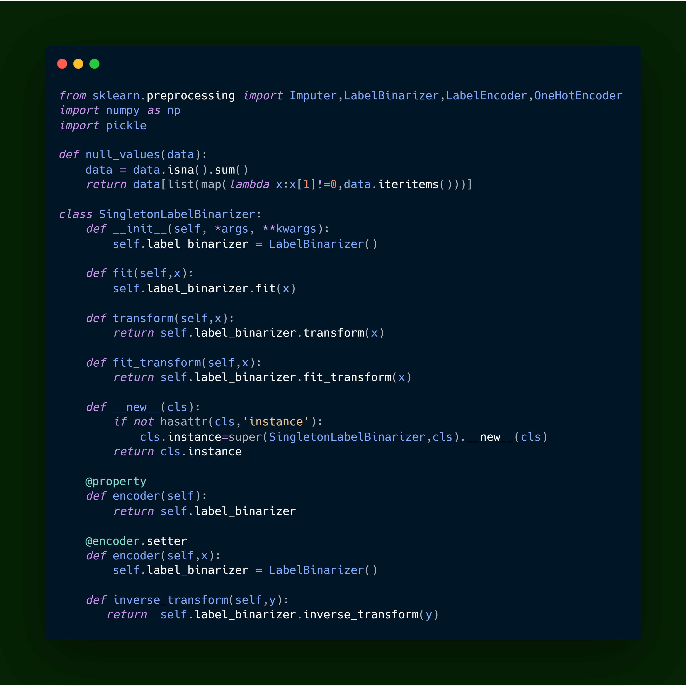

Labelling Binarizer Instance
============================

|checkout|

A Python Script used for Data Modelling to label Binary Instance.

.. |checkout| image:: https://forthebadge.com/images/badges/check-it-out.svg
  :target: https://github.com/HarshCasper/Rotten-Scripts/tree/master/Python/Labelling_Binarizer_Instance/

