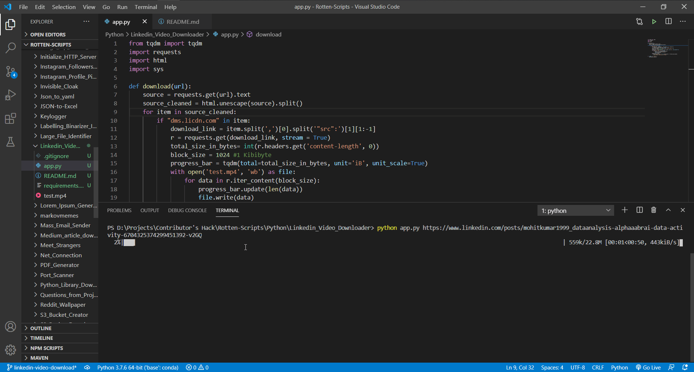

Linkedin Video Downloader
=========================

|checkout|

This script uses Python requests library to grab the url of the linkedin
post provided to get the video url. After getting the url of the video,
the file gets saved as video file. A progress bar is displayed showing
the current speed, time escaped & time left. The progress bar is
implemented using tqdm.

How to use?
===========

-  Install the dependencies required for this script (tqdm & requests):

.. code-block:: bash

   pip install requirements.txt

-  Use this format to download the video:

.. code-block:: bash

   python app.py <link of post>

Working Demo
============

.. |checkout| image:: https://forthebadge.com/images/badges/check-it-out.svg
  :target: https://github.com/HarshCasper/Rotten-Scripts/tree/master/Python/Linkedin_Video_Downloader/

