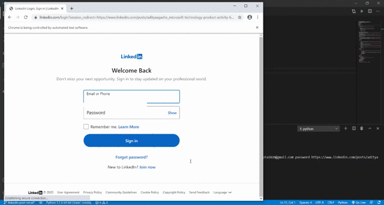

Linkedin Post Comments Email Scrapper
=====================================

|checkout|

This script scraps all the emails from the Linkedin post. These post are
mainly done by people sending bulk emails to large audience. This script
collects all of them and saves them as CSV file which can be further
automated to send emails.

How to use?
-----------

As it is a command line utility, simply run the file in given format:

.. code-block:: bash

   python app.py linkedin_username linkedin_password linkedin_post_link

Before running the script, make sure you have the required dependencies.
Not sure about them? Run the following command before running the actual
script:

.. code-block:: bash

   pip install -r reqirements.txt

Also you will require latest chrome driver. Download latest one from `here <https://chromedriver.chromium.org/downloads>`__ and place in the same location where script lies.

Working Demo
------------

.. |checkout| image:: https://forthebadge.com/images/badges/check-it-out.svg
  :target: https://github.com/HarshCasper/Rotten-Scripts/tree/master/Python/Linkedin_post_emails_scrapper/

