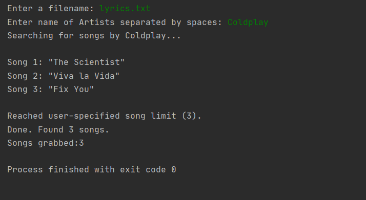
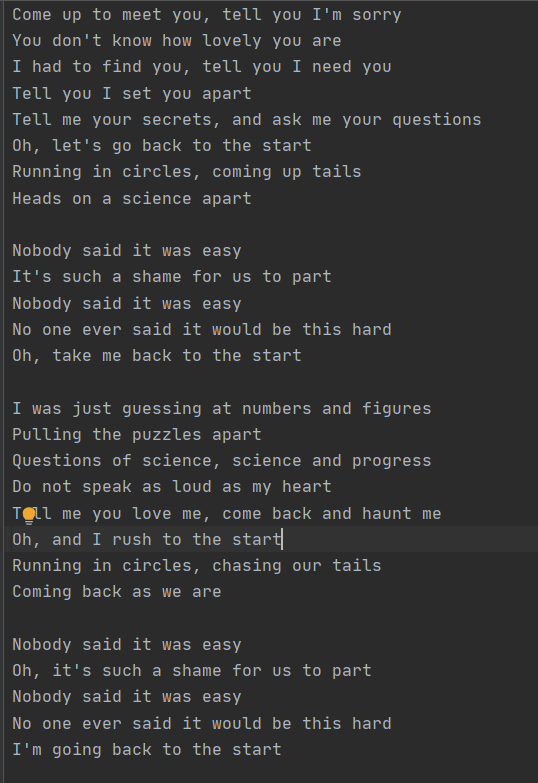

Lyrics_Download
===============

|checkout|

This script can be used to download lyrics of any number of songs, by
any number of Artists, until the API Limit is met. The script uses
`Genius API <https://docs.genius.com/>`__. It is a dedicated platform
meant for music only.

Setup Instruction
-----------------

-  You need an API client, (it’s free) follow the steps `here <https://docs.genius.com/>`__.
-  ``pip install lyricsgenius`` to install dedicated package.
-  Good to go, Follow guidelines mentioned as comments in code.
-  The script is pretty much interactive, ensure you follow the guidelines.

Output
------

Lyrics of Top 3 Songs by coldplay -

|image0|

Resulting Text File -

|image1|

Author(s)
---------

Made by `Vybhav Chaturvedi <https://www.linkedin.com/in/vybhav-chaturvedi-0ba82614a/>`__.

.. important::

   Kindly go through this `page <https://genius.com/static/terms>`__ and
   follow the guidelines and rules related to **Genius API**.

.. |checkout| image:: https://forthebadge.com/images/badges/check-it-out.svg
  :target: https://github.com/HarshCasper/Rotten-Scripts/tree/master/Python/Lyrics_Download/

