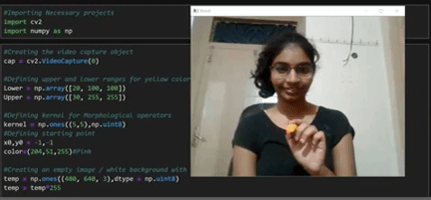

# Magic-Pen
Ever dreamed of drawing stuff on the screen just by waving your pen in the air...Well that is exactly what Magic Pen does using Python(OpenCV and NumPy).

## To run the code

(Preferable IDE - Jupyter Notebook)
- Clone the folder- Magic-Pen
- You must have python ,opencv and numpy installed
- In cmd do:
  - pip install numpy
  - pip install opencv-python
  - Also check for any package that's need to be installed, on cmd
  - then run the script in jupyter lab/notebok!

