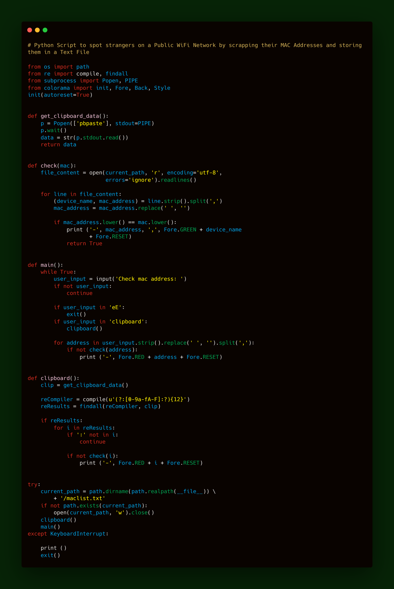

Meet Strangers
==============

|checkout|

This is a Python Script that was interestingly written to spot strangers
on a Public WiFi Network by scrapping their MAC Addresses and storing
them in a Text File.

.. |checkout| image:: https://forthebadge.com/images/badges/check-it-out.svg
  :target: https://github.com/HarshCasper/Rotten-Scripts/tree/master/Python/Meet_Strangers/

