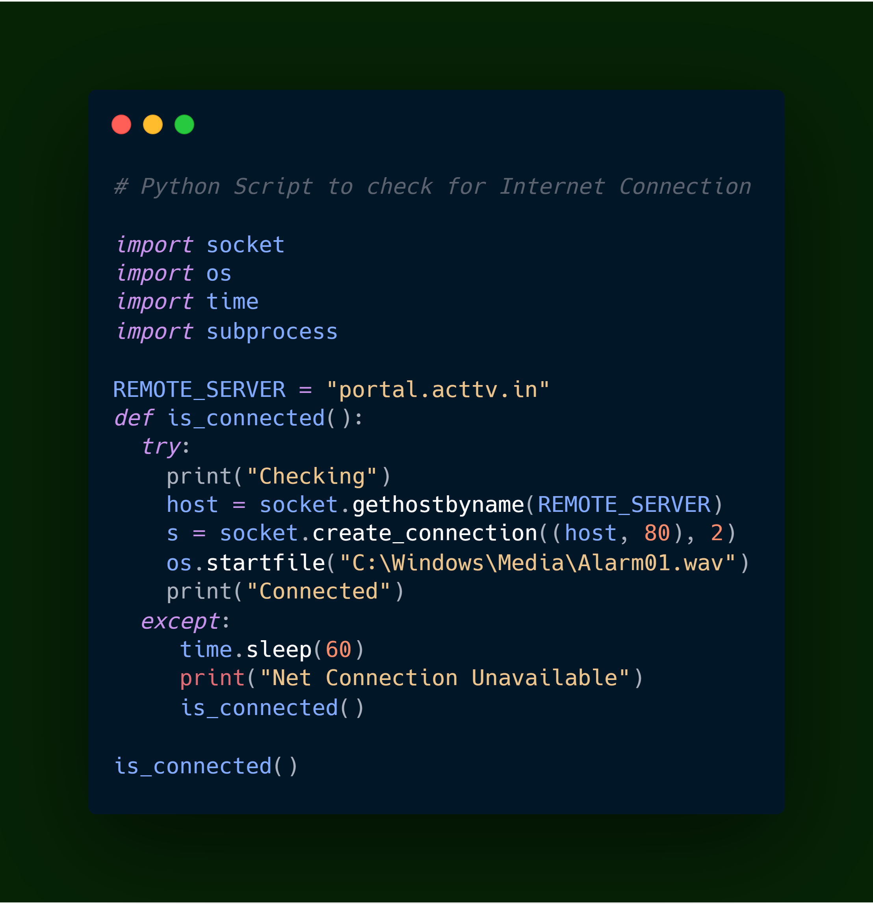

Net Connection
==============

|checkout|

This is a Python Script to check for Internet Connection using Socket
and Time Module.

.. |checkout| image:: https://forthebadge.com/images/badges/check-it-out.svg
  :target: https://github.com/HarshCasper/Rotten-Scripts/tree/master/Python/Net_Connection/

