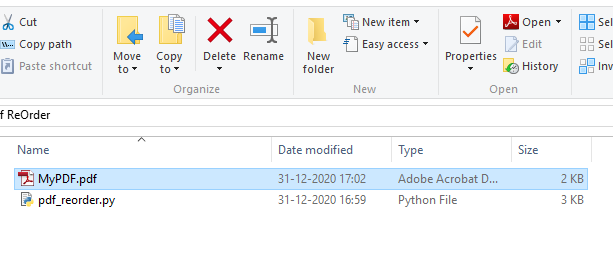
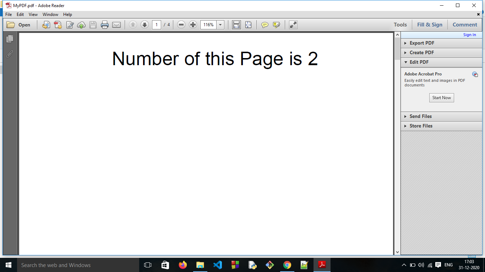
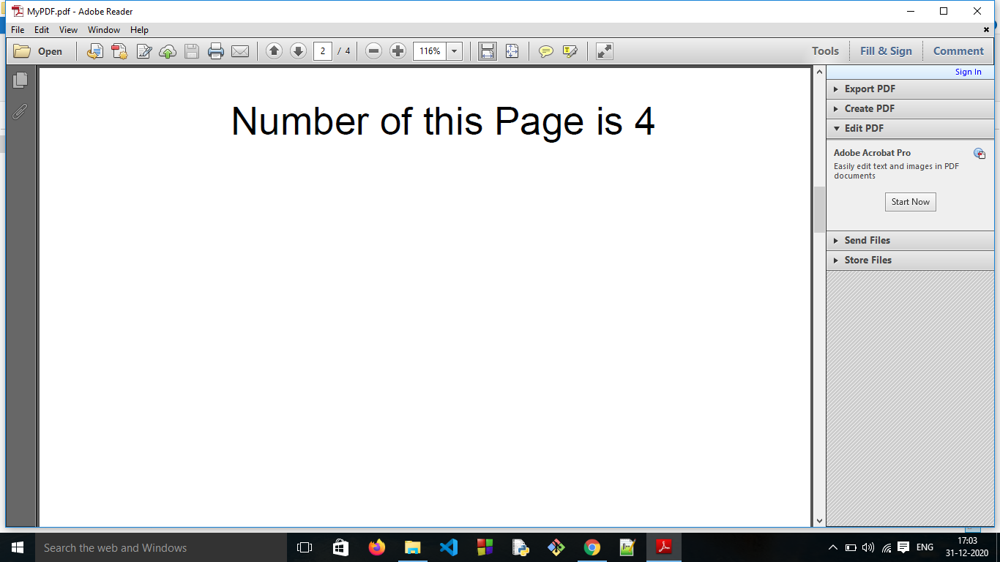
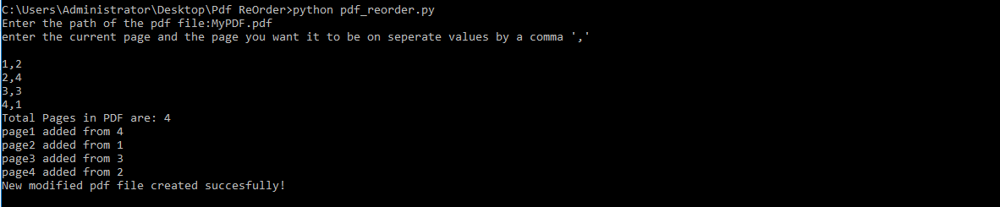
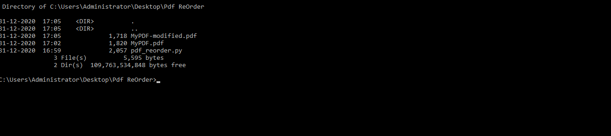
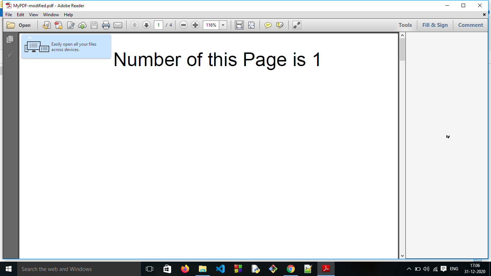

# PDF reordering script

This script can be used for reordering a pdf file which may have pages in wrong order.

## Setup instructions

- We use **pdfrw** library for this script. 
- After downloading the folder switch to the folder's location on your commmand line.
- To download required libraries enter `pip -r requirements.txt` in command line
- To run the script `python3 pdf_reorder_.py` and then enter the required information.
- After running the script it will create a modified file in the same folder as that of the original pdf file.

## About the script pdf_reorder_.py

* It takes path of the file as an Input.
* Then it takes current page which is in the wrong order and the right page no. it should be on.
* Seperate values by a comma ' , ' and line by line.
  * Example:-  
  
	`1,2`  
	`3,1`  
	`2,3`
     	
      *here the 1st page in the pdf should be on the 2nd page instead and so on.*

* The script parses and sorts the input values by the function input_and_parse(n) 
  which takes no. of pages in pdf file as input.
* Then using the reorder() function we can get the desired file after rearranging.

## Demo 
A short demo of how the script works

Here We have a pdf file MyPDF.pdf which has pages in wrong order we also have the script that will make it right!

We can see in the below two images that in the PDF file contents of page 2 are on page 1,contents of page 4 are on page 2 and so on.

After entering the required input like the path of the file and the current page which is in the wrong order and the right page no. it should be on seperated by commas ','.
The script runs a modified file is created.

We can see the contents of the directory and the modified file will be present there.

Voila! the pages are in the right order now.

## Author:

[Mohta Rahul Suresh](https://github.com/Rahul555-droid/)
