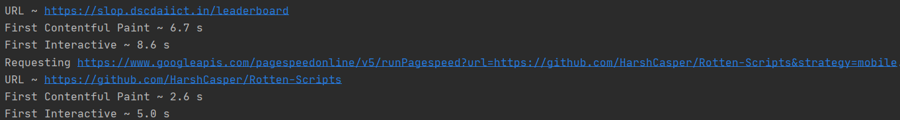

# Pagespeed_API

This self explanatory script, uses [Pagespeed_API](https://developers.google.com/speed/docs/insights/v5/get-started).
It can be used to - 

- Measure the performance of a web page. (Achieved in this Script)
- Improve accessibility, and SEO. (Out of Scope)

## Setup instructions and Guidelines

This setup has only one requirement, `request`. Usually it is auto-downloaded with other packages.

If that's not the case `pip  install request` will do the job.

Further more, the script requires a separate `pagespeed.txt.` file (Name can be changed).
This file is supposed to contain a list of urls, which are to be measured using the API.

The script has proper comments which should be followed. The script is easy to use.

## Output
This Snapshot clearly shows the Interactive time of 2 webpages.

## Author(s)  
  
Made by [Vybhav Chaturvedi](https://www.linkedin.com/in/vybhav-chaturvedi-0ba82614a/).

## Disclaimers, if any

Kindly go through this [page](https://nodepit.com/node/com.mmiagency.knime.nodes.google.pagespeed.GooglePageSpeedNodeFactory) and follow the guidelines and rules related to **PageSpeed API**.