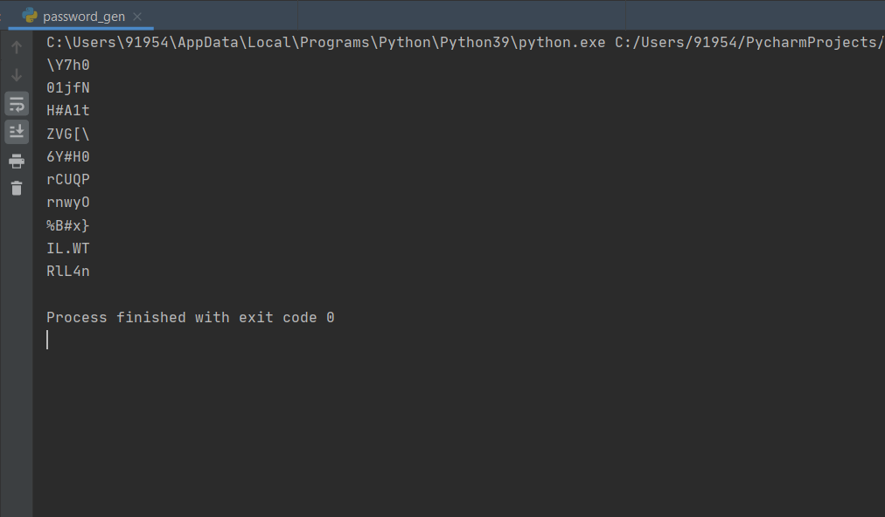
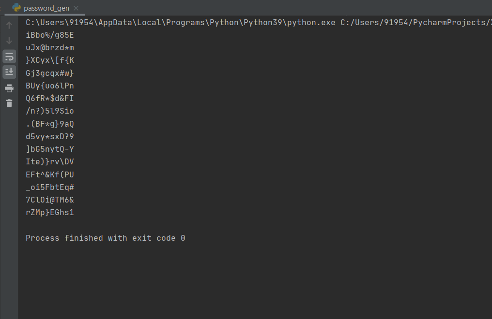
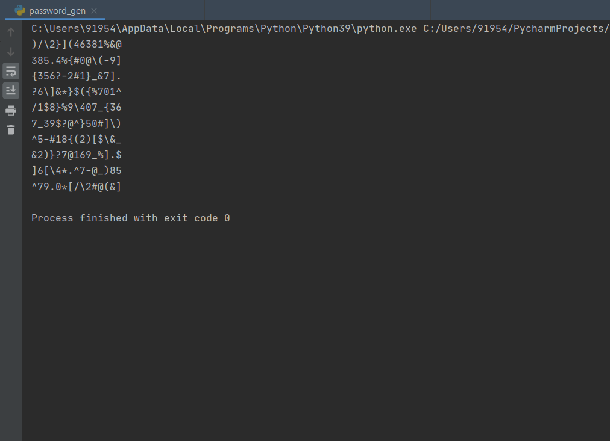

# Password Generator
We will be creating a project for generating password but not the simple one, this project will generate unique and strong password i.e. these passwords will include a combination of uppercase and lowercase letters, numbers, and symbols.

The library used in this project is-

#### random

The `random` package provides a Python 3 ported version of Python 2.7’s `random` module. It has also been back-ported to work in Python 2.6.

In Python 3, the implementation of `randrange()` was changed, so that even with the same seed you get different sequences in Python 2 and 3. Note that several high-level functions such as `randint()` and `choice()` use `randrange()`

### Installation
Install the library using `pip` command in any terminal

```python
pip install random
```

OR

```python
pip install -r requirements.txt
```

### Working 
To start using this project, follow the below guidelines: 

**1.**  Fork this project/repository.

**2.**  Clone your forked copy of the project/repository.

```
git clone https://github.com/<your-github-username>/Rotten-Scripts.git
```

**3.** Navigate to the project directory.

```
cd Rotten-Scripts/Password_Generator/
```

**4.** Install the `requirements.txt` using the given command.

```
pip install -r requirements.txt
```

**5.** Run `pass_generator.py` file in PyCharm IDE or Jupyter Notebook or any other platform.

### Screenshots







### Contributor

<a href="https://github.com/Umesh-01">Umesh Singh</a>
