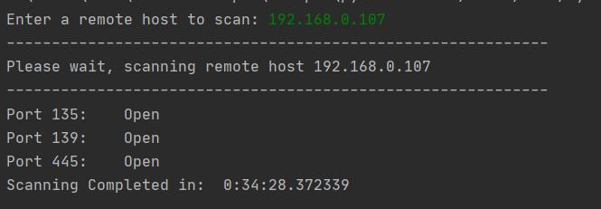
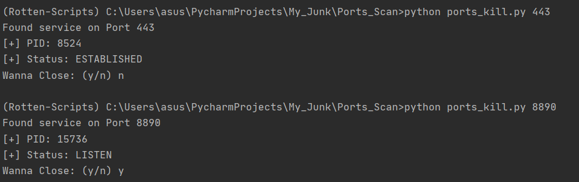
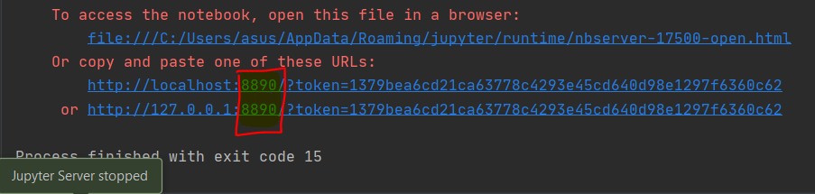

Port_Scan
=========

|checkout|

A lot of times, a remote host, gets bound to a port and starts running a
process on it. This is not only undesirable but also can be dangerous. I
made a set of two scripts, in order to solve the mess. One to check the
currently active ports, another one to kill the process running on them.

The Script uses ``psutil`` module to solve the purpose, unarguably the
``lsof`` package provided in Linux is way better. But as it is not cross
platform, I have hardcoded using
`psutil <https://psutil.readthedocs.io/en/latest/>`__. ## Setup
instructions

There are 2 scripts.
- `ports_scan.py <./ports_scan.py>`__
- `ports_kill.py <./ports_kill.py>`__

1. Setup a Virtual Environment.
2. Install dependencies using ``pip3 install -r requirements.txt``
3. Go through the comments and the interactive options.
4. For ``ports_kill.py`` Sample -
   ``python3 ports_kill.py <port number>``

Output
------

Sample Outputs -

-  **ports_scan.py**

-  **ports_kill.py**

Author(s)
---------

Made by `Vybhav Chaturvedi <https://www.linkedin.com/in/vybhav-chaturvedi-0ba82614a/>`__

.. |checkout| image:: https://forthebadge.com/images/badges/check-it-out.svg
  :target: https://github.com/HarshCasper/Rotten-Scripts/tree/master/Python/Ports_Scan/

