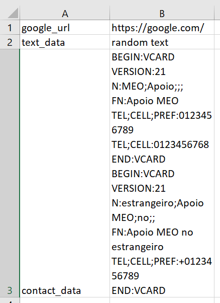

QR Code Generator
=================

|checkout|

Script generates QR code for data listed in a csv file
------------------------------------------------------

How to use
----------

.. code-block:: bash

   python qrcode_generator.py --f <csv input file>

Example
-------

.. code-block:: bash

   python qrcode_generator.py --f input.csv

Input File
----------

-  Script takes input from a csv file
-  Input file should contain 2 columns(without headings, i.e. data
   starts from row 0)
-  1st column = file name with which qr code should be saved.
-  2nd column = data for which qr code should be generated.

Snap of sample input
--------------------

.. |checkout| image:: https://forthebadge.com/images/badges/check-it-out.svg
  :target: https://github.com/HarshCasper/Rotten-Scripts/tree/master/Python/QR_code_generator/

